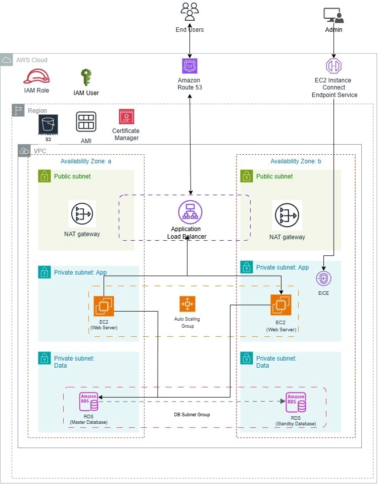

# 🚀 Dynamic Web Application on AWS

This project demonstrates a secure, scalable, and highly available architecture for deploying a dynamic web application using AWS services. The architecture supports fault tolerance, autoscaling, and follows AWS best practices for production workloads.

---

## 📊 Architecture Diagram

---

## 🧱 Architecture Components

### Networking
- **VPC** with 2 Availability Zones (AZs)
- **Public Subnets** for NAT Gateways
- **Private Subnets (App Tier)** for EC2 Web Servers
- **Private Subnets (Data Tier)** for Amazon RDS
- **DB Subnet Group** for Multi-AZ RDS deployment

### Compute
- **EC2 Instances** in private subnets for running the web app
- **Auto Scaling Group** to manage load and availability
- **Application Load Balancer (ALB)** for traffic distribution

### Database
- **Amazon RDS (Multi-AZ)** for relational database hosting
- **DB Subnet Group** for redundancy and failover

### Security & Access
- **IAM Roles and Policies** for access management
- **NAT Gateways** to provide internet access to private subnets
- **EC2 Instance Connect Endpoint** for secure admin access

### Routing & DNS
- **Amazon Route 53** for domain name resolution
- **AWS Certificate Manager (ACM)** for SSL certificates

---

## 🛠️ Deployment Overview

1. **Provision AWS Infrastructure**
   - Use IaC tools like Terraform, AWS CDK, or CloudFormation to create:
     - VPC, Subnets, Route Tables, Internet Gateway, NAT Gateways
     - Security Groups
     - EC2 Launch Template and Auto Scaling Group
     - RDS instance and DB subnet group
     - ALB with target groups and listeners

2. **Deploy Application**
   - Deploy your application code to EC2 instances
   - Ensure security groups and IAM roles are correctly applied

3. **Set Up DNS and SSL**
   - Point Route 53 domain to ALB DNS
   - Request and attach SSL cert via ACM

---

## ✅ Key Features

- High availability via Multi-AZ deployment
- Scalable web tier with EC2 Auto Scaling
- Secure access via private subnets and IAM policies
- Centralized DNS and SSL management

---

## 🔐 Security Best Practices

- No public IPs on EC2 in private subnets
- Access via EC2 Connect Endpoint or Session Manager
- Encrypted RDS with backup enabled
- Principle of least privilege for IAM

